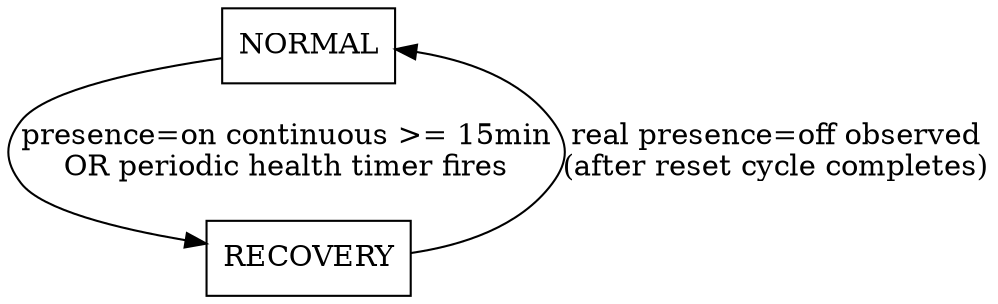

# Sanitized Presence — Recovery State Machine

Date: 2026-05-29
Status: Approved (design phase); revised per GFN-CIS global-rules audit

## Problem

Tuya MTG075-ZB-RL / MTG275-ZB-RL ZigBee radars occasionally latch their
native presence (occupancy) data point into `on` and stop reflecting
real-world occupancy. The current integration gates `sanitized_presence`
on `target_distance` at all times. In practice `target_distance` is
unreliable: it tends to collapse to a static/zero value, so the
distance-based gate *hurts* normal operation rather than helping it.

The recovery logic that actually unsticks the firmware already exists as a
standalone pyscript (`<config>/pyscript/occupancy_reset.py`). We want
to fold its essential behavior into this integration, drop the parts that
proved unnecessary, and only fall back to distance heuristics while we are
actively trying to recover a suspected-stuck device.

## Goal

Replace the always-on distance gate with a two-state machine:

- **NORMAL** — mirror the native presence DP verbatim.
- **RECOVERY** — distance-based output while driving a select-entity reset
  cycle to unstick the radar firmware.

Port the reset cycle and safety rails from the pyscript into the
integration. Delete the pyscript afterwards.

## Non-Goals

- Porting the pyscript stuck-detection heuristics (range window,
  `shield < target < detection`, 3-update confirmation). These are dropped.
- Any new config-flow UI. All tuning parameters are code constants.
- Changing the discovery matching strategy (still Z2M `unique_id` suffix).

## Output Semantics

`binary_sensor.<device>_sanitized_presence` produces:

| State    | Output formula                                        |
|----------|-------------------------------------------------------|
| NORMAL   | `sanitized = native_presence_DP` (direct mirror)      |
| RECOVERY | `sanitized = in_range(shield < target < detection)`   |

In RECOVERY the presence DP is considered untrusted, so it is **not** part
of the distance formula — only the measured `target_distance` against the
`shield_range`/`detection_range` window decides the output. This avoids
flicker from the presence DP being artificially toggled by our own reset
cycle.

## State Machine



### NORMAL (default / startup)

- Output mirrors native presence DP.
- Track the timestamp at which presence most recently transitioned to `on`
  (reset the timer on every `off`). This drives the 15-minute trigger.
- Distance/range entities are ignored.

**Transitions to RECOVERY** when either condition holds:

1. **Latch trigger**: presence has been continuously `on` for
   `RECOVERY_PRESENCE_ON_SEC` (= 900 s / 15 min) without any intervening
   `off`.
2. **Health trigger**: `HEALTH_RESET_INTERVAL_SEC` (= 1800 s) have elapsed
   since the device's last reset cycle completed (or since startup).

Both triggers produce identical RECOVERY behavior; only the trigger source
differs (recorded for diagnostics/logging).

### RECOVERY

- Output switches to distance-mode (`in_range` only — see Output Semantics).
- Start a **reset cycle** on the device's select-entity (`sensor` DP):
  drive it through `SENSOR_RESET_SEQUENCE = ("off", "unoccupied", "on")`.
  - Hold the first `off` for `RADAR_RESTART_DELAY` (= 30 s) so the radar
    firmware de-energizes.
  - Wait `SENSOR_PHASE_DELAY_SEC` (= 0.5 s) between the remaining
    transitions so the Tuya MCU and Z2M can acknowledge each phase.
- While the cycle is running (`resetting` guard active), **ignore all
  presence-DP transitions** — they are echoes of our own commands.
- After the cycle completes (final `on` written, cooldown begins), watch
  for a **real `presence=off`**. The first genuine `off` after the cycle
  means the firmware is alive again.

**Transitions to NORMAL** on the first real `presence=off` observed after
the reset cycle has completed.

If the device stays latched (`presence=on` never clears), it remains in
RECOVERY; subsequent reset cycles are gated by the safety rails below.

## Safety Rails (ported from pyscript)

- **Re-entrancy guard**: never start a reset cycle while one is already
  running for that device (`_device_state == "resetting"`).
- **Cooldown** `RESET_COOLDOWN_SEC` (= 120 s): minimum gap between the end
  of one reset cycle and the start of the next for a device.
- **Rate limit / circuit breaker**:
  - `RESET_RATE_LIMIT` (= 3) resets allowed per
    `RESET_RATE_WINDOW_SEC` (= 1800 s) sliding window.
  - On overflow, block further resets for `RESET_RATE_BLOCK_SEC` (= 1800 s).
- **Off-fallback** (runs every minute): a completed cycle always ends in
  `on`, so a select stuck in `off` indicates an interrupted cycle (e.g.
  integration restart mid-cycle). Restore it to `on` without walking the
  rest of the cycle. Bypasses cooldown/rate limiter on purpose — it is a
  recovery tool, not a reset.

## Discovery Changes

Add a new required suffix:

- `SUFFIX_SENSOR = "sensor"` — the select-entity that exposes the radar
  operating mode. The reset cycle drives this entity; without it recovery
  is impossible, so devices missing it are skipped (with a warning) like
  any other missing required entity.

Required suffixes become:

```
target_distance, detection_range, shield_range, departure_delay,
presence, sensor
```

## Constants (const.py)

| Constant                   | Value | Source / meaning                          |
|----------------------------|-------|-------------------------------------------|
| `RECOVERY_PRESENCE_ON_SEC` | 900   | continuous presence=on -> enter recovery  |
| `HEALTH_RESET_INTERVAL_SEC`| 1800  | proactive periodic reset cadence          |
| `RADAR_RESTART_DELAY`      | 30    | hold first `off` so firmware de-energizes |
| `SENSOR_PHASE_DELAY_SEC`   | 0.5   | debounce between cycle phases             |
| `RESET_COOLDOWN_SEC`       | 120   | min gap between resets                     |
| `RESET_RATE_WINDOW_SEC`    | 1800  | rate-limit sliding window                  |
| `RESET_RATE_LIMIT`         | 3     | max resets per window                      |
| `RESET_RATE_BLOCK_SEC`     | 1800  | circuit-breaker block duration            |
| `SENSOR_RESET_SEQUENCE`    | `("off","unoccupied","on")` | select-walk order |
| `SUFFIX_SENSOR`            | `"sensor"` | select-entity unique_id suffix       |

Pulse-model constants (`DEFAULT_DELAY_S`, `DELAY_MIN_S`, `DELAY_MAX_S`,
`TICK_FLOOR_S`, `TICK_CEILING_S`) are removed once unreferenced.

## Component Design

Responsibilities are split to keep each unit single-purpose and
independently testable (SoC/SRP). The entity stays thin; the recovery
orchestration and safety rails live in a dedicated collaborator.

- **`binary_sensor.py`** (`SanitizedPresenceBinarySensor`) — thin HA entity.
  Owns: the two-state output (presence mirror in NORMAL, `in_range` in
  RECOVERY), subscribing to source state changes, the per-device latch/
  health timers that decide *when* to request recovery, and writing HA
  state. It delegates the *how* of recovery to `RecoveryController`. It does
  not contain reset-cycle, cooldown, rate-limit, or circuit-breaker logic.
- **`recovery.py`** (new — `RecoveryController`) — owns the reset mechanics
  and all safety rails as one coherent, independently-testable unit:
  - drives the select-entity through `SENSOR_RESET_SEQUENCE`
    (`select_option` + async sleeps);
  - re-entrancy guard, cooldown, rate-limit/circuit-breaker, off-fallback;
  - exposes a small interface: `request_reset(reason) -> bool` (returns
    whether a cycle started or was blocked), `is_resetting`, and a
    diagnostics snapshot (last reset ts, cooldown left, rate-window count,
    circuit-breaker block left). The entity reads the snapshot for the
    status sensor and the "ignore presence echoes while resetting" gate.

  This extraction is justified under `code.md` (the safety-rail state is a
  coherent boundary and enables clean test isolation), not a gratuitous
  helper.
- **`discovery.py`** — add `SUFFIX_SENSOR` to required suffixes; resolve the
  select entity_id; construct a `RecoveryController` per device and inject
  it (plus the select entity_id) into the binary sensor.
- **`const.py`** — add the constants above; remove distance pulse constants
  (`DEFAULT_DELAY_S`, `DELAY_MIN_S`, `DELAY_MAX_S`, `TICK_FLOOR_S`,
  `TICK_CEILING_S`) once the rewrite no longer references them.
- **`sensor.py`** — repurpose `DeadlineSensorEntity` into
  **`StatusSensorEntity`** (diagnostic). `native_value` = current mode
  (`normal` / `recovery`). `extra_state_attributes` = trigger reason for the
  current/last recovery, last reset timestamp, cooldown-left, rate-window
  count, and circuit-breaker block-left, sourced from the controller's
  diagnostics snapshot. The old `set_expiry()` deadline API is removed (no
  sliding deadline in the new model); replaced by a `set_status(...)` update
  hook. Keep the `unique_id` migration in mind: changing the suffix from
  `_sanitized_presence_deadline` would orphan the old entity — keep the
  existing `unique_id` or provide a registry migration. (Decide during
  implementation; default: keep the existing `unique_id`, rename only the
  friendly name/icon.)

### Dead-code removal (requires explicit approval)

- **`auto_reset.py`** (`AutoResetBinarySensor`) — the pulse/deadline base is
  vestigial in the state-driven model (no `pulse()`/sliding window). It is a
  **removal candidate**, but per `code.md` dead code must not be deleted
  without explicit user approval. The implementation plan must include an
  explicit confirmation step (show that nothing references it) **before**
  deleting it.

## Reset Cycle Concurrency & Error Handling

`select.select_option` is async and the cycle includes long sleeps
(30 s + debounces). Requirements:

- Run the cycle as a tracked `asyncio` task (or HA-native scheduling) so it
  never blocks the event loop; cancel it in
  `async_will_remove_from_hass` and on integration unload.
- **Fail-fast, specific exceptions** (no blanket `except`): wrap each
  `select_option` call and catch the specific HA/service exceptions
  (e.g. `HomeAssistantError`, `ServiceNotFound`, `vol.Invalid` for a
  rejected option). On failure: log with context (`device_id`, phase,
  option, exception) at `warning`/`error`, abort the remaining phases, and
  ensure the select is left in a safe state — never parked in `off`
  (the off-fallback is the last-resort net, not the primary handler).
- `asyncio.CancelledError` must propagate (do not swallow) so removal/unload
  cancels cleanly.
- The "ignore presence echoes" gate is keyed on `RecoveryController.is_resetting`
  and must be cleared in a `finally` block so a failed cycle does not leave
  the gate stuck closed.

## Fallback Logging & Scope (agreed upfront)

Two fallbacks exist by explicit design decision; both must log when they
act:

- **Distance-mode** (RECOVERY output) is a scoped fallback active only while
  recovering. Entry logs the trigger reason; exit (`RECOVERY -> NORMAL`) logs
  the observed real `presence=off`. Removal condition: it is exited
  automatically on return to NORMAL — there is no permanent distance path.
- **Off-fallback** intentionally bypasses cooldown/rate-limit (it is a
  recovery tool, not a reset). Each activation logs at `info` with device
  context. This bypass is the agreed scope, documented here so it is not
  mistaken for a missing safety rail.

## Testing Strategy

Unit tests (run via `PYTHONPATH=. pytest -q -m "not docker_e2e"`), located
next to the code under `custom_components/sanitized_presence/tests/` and
auto-discovered by pytest.

**Test discipline (per `testing.md`):**

- Test *behavior*, not shape: each test must fail if the corresponding logic
  breaks (a dumb stub must not pass).
- **Determinism**: the 900 s / 1800 s timers and `async_call_later` /
  `async_track_time_interval` schedules MUST be driven by virtual time
  (`freezegun` / `async_fire_time_changed`), never real wall-clock waits.
  Reset-cycle sleeps are mocked.
- **Avoid brittle assertions**: exact `select_option` call-order assertions
  are permitted **only** because `SENSOR_RESET_SEQUENCE` order *is the
  firmware-recovery contract*; do not assert incidental timing beyond the
  documented phase delays.
- Each test carries the mandated structured docstring (Validates / Code /
  Assertion / Method); regression-style cases (interrupted cycle /
  off-fallback, device stays latched) use the regression template.

**Scenarios:**

- NORMAL mirrors presence on/off exactly.
- Latch trigger: presence=on held past `RECOVERY_PRESENCE_ON_SEC` enters
  RECOVERY; intervening `off` resets the timer and prevents entry.
- Health trigger: enters RECOVERY after `HEALTH_RESET_INTERVAL_SEC` with no
  reset.
- RECOVERY output uses `in_range` only (presence ignored).
- Reset cycle walks `SENSOR_RESET_SEQUENCE` in order with correct delays
  (assert select_option call order; mock sleeps).
- Presence transitions during an active cycle are ignored.
- Real `presence=off` after cycle completion returns to NORMAL.
- Cooldown blocks back-to-back resets.
- Rate limit trips the circuit breaker after `RESET_RATE_LIMIT` resets.
- Reset-cycle error handling: a failing `select_option` aborts remaining
  phases, logs context, clears the `is_resetting` gate, and never leaves the
  select in `off`.
- Off-fallback flips a select stuck in `off` back to `on`.
- `StatusSensorEntity` reports the current mode and the controller
  diagnostics (cooldown/rate-window/circuit-breaker) accurately.
- Discovery skips devices missing the `sensor` select entity.

## Deployment & Release

- Bump `manifest.json` version (HACS pulls from releases; without a bump
  the change is reverted). Release auto-triggers on `manifest.json` change
  pushed to `main`.
- Deploy to the target HA host's
  `<config>/custom_components/sanitized_presence/` (deployment host/path are
  environment-local and kept out of this committed doc).
- After the integration is verified on the live fleet, **delete**
  `<config>/pyscript/occupancy_reset.py` so the two do not both drive
  the select entity.

## Migration / Coexistence Risk

While both the pyscript and the integration are active they would both
write to the same select-entity, causing competing reset cycles. The
pyscript MUST be removed as part of the rollout (after the integration is
confirmed working), not left running alongside.
