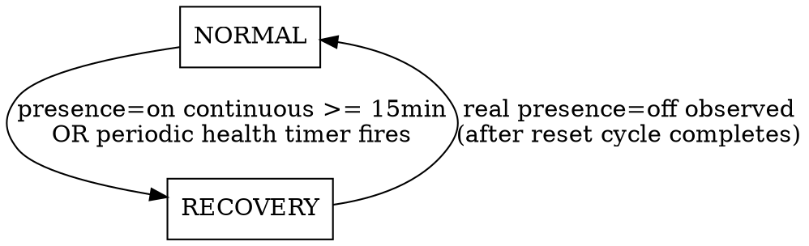

# Sanitized Presence — Recovery State Machine

Date: 2026-05-29
Status: Approved (design phase)

## Problem

Tuya MTG075-ZB-RL / MTG275-ZB-RL ZigBee radars occasionally latch their
native presence (occupancy) data point into `on` and stop reflecting
real-world occupancy. The current integration gates `sanitized_presence`
on `target_distance` at all times. In practice `target_distance` is
unreliable: it tends to collapse to a static/zero value, so the
distance-based gate *hurts* normal operation rather than helping it.

The recovery logic that actually unsticks the firmware already exists as a
standalone pyscript (`/homeassistant/pyscript/occupancy_reset.py`). We want
to fold its essential behavior into this integration, drop the parts that
proved unnecessary, and only fall back to distance heuristics while we are
actively trying to recover a suspected-stuck device.

## Goal

Replace the always-on distance gate with a two-state machine:

- **NORMAL** — mirror the native presence DP verbatim.
- **RECOVERY** — distance-based output while driving a select-entity reset
  cycle to unstick the radar firmware.

Port the reset cycle and safety rails from the pyscript into the
integration. Delete the pyscript afterwards.

## Non-Goals

- Porting the pyscript stuck-detection heuristics (range window,
  `shield < target < detection`, 3-update confirmation). These are dropped.
- Any new config-flow UI. All tuning parameters are code constants.
- Changing the discovery matching strategy (still Z2M `unique_id` suffix).

## Output Semantics

`binary_sensor.<device>_sanitized_presence` produces:

| State    | Output formula                                        |
|----------|-------------------------------------------------------|
| NORMAL   | `sanitized = native_presence_DP` (direct mirror)      |
| RECOVERY | `sanitized = in_range(shield < target < detection)`   |

In RECOVERY the presence DP is considered untrusted, so it is **not** part
of the distance formula — only the measured `target_distance` against the
`shield_range`/`detection_range` window decides the output. This avoids
flicker from the presence DP being artificially toggled by our own reset
cycle.

## State Machine



### NORMAL (default / startup)

- Output mirrors native presence DP.
- Track the timestamp at which presence most recently transitioned to `on`
  (reset the timer on every `off`). This drives the 15-minute trigger.
- Distance/range entities are ignored.

**Transitions to RECOVERY** when either condition holds:

1. **Latch trigger**: presence has been continuously `on` for
   `RECOVERY_PRESENCE_ON_SEC` (= 900 s / 15 min) without any intervening
   `off`.
2. **Health trigger**: `HEALTH_RESET_INTERVAL_SEC` (= 1800 s) have elapsed
   since the device's last reset cycle completed (or since startup).

Both triggers produce identical RECOVERY behavior; only the trigger source
differs (recorded for diagnostics/logging).

### RECOVERY

- Output switches to distance-mode (`in_range` only — see Output Semantics).
- Start a **reset cycle** on the device's select-entity (`sensor` DP):
  drive it through `SENSOR_RESET_SEQUENCE = ("off", "unoccupied", "on")`.
  - Hold the first `off` for `RADAR_RESTART_DELAY` (= 30 s) so the radar
    firmware de-energizes.
  - Wait `SENSOR_PHASE_DELAY_SEC` (= 0.5 s) between the remaining
    transitions so the Tuya MCU and Z2M can acknowledge each phase.
- While the cycle is running (`resetting` guard active), **ignore all
  presence-DP transitions** — they are echoes of our own commands.
- After the cycle completes (final `on` written, cooldown begins), watch
  for a **real `presence=off`**. The first genuine `off` after the cycle
  means the firmware is alive again.

**Transitions to NORMAL** on the first real `presence=off` observed after
the reset cycle has completed.

If the device stays latched (`presence=on` never clears), it remains in
RECOVERY; subsequent reset cycles are gated by the safety rails below.

## Safety Rails (ported from pyscript)

- **Re-entrancy guard**: never start a reset cycle while one is already
  running for that device (`_device_state == "resetting"`).
- **Cooldown** `RESET_COOLDOWN_SEC` (= 120 s): minimum gap between the end
  of one reset cycle and the start of the next for a device.
- **Rate limit / circuit breaker**:
  - `RESET_RATE_LIMIT` (= 3) resets allowed per
    `RESET_RATE_WINDOW_SEC` (= 1800 s) sliding window.
  - On overflow, block further resets for `RESET_RATE_BLOCK_SEC` (= 1800 s).
- **Off-fallback** (runs every minute): a completed cycle always ends in
  `on`, so a select stuck in `off` indicates an interrupted cycle (e.g.
  integration restart mid-cycle). Restore it to `on` without walking the
  rest of the cycle. Bypasses cooldown/rate limiter on purpose — it is a
  recovery tool, not a reset.

## Discovery Changes

Add a new required suffix:

- `SUFFIX_SENSOR = "sensor"` — the select-entity that exposes the radar
  operating mode. The reset cycle drives this entity; without it recovery
  is impossible, so devices missing it are skipped (with a warning) like
  any other missing required entity.

Required suffixes become:

```
target_distance, detection_range, shield_range, departure_delay,
presence, sensor
```

## Constants (const.py)

| Constant                   | Value | Source / meaning                          |
|----------------------------|-------|-------------------------------------------|
| `RECOVERY_PRESENCE_ON_SEC` | 900   | continuous presence=on -> enter recovery  |
| `HEALTH_RESET_INTERVAL_SEC`| 1800  | proactive periodic reset cadence          |
| `RADAR_RESTART_DELAY`      | 30    | hold first `off` so firmware de-energizes |
| `SENSOR_PHASE_DELAY_SEC`   | 0.5   | debounce between cycle phases             |
| `RESET_COOLDOWN_SEC`       | 120   | min gap between resets                     |
| `RESET_RATE_WINDOW_SEC`    | 1800  | rate-limit sliding window                  |
| `RESET_RATE_LIMIT`         | 3     | max resets per window                      |
| `RESET_RATE_BLOCK_SEC`     | 1800  | circuit-breaker block duration            |
| `SENSOR_RESET_SEQUENCE`    | `("off","unoccupied","on")` | select-walk order |
| `SUFFIX_SENSOR`            | `"sensor"` | select-entity unique_id suffix       |

## Component Design

- **`binary_sensor.py`** — rewritten. Holds the two-state machine, presence
  mirror, distance-mode evaluation, and the per-device timers driving the
  latch and health triggers. Owns the `select_option` calls for the reset
  cycle and the safety-rail state (cooldown, rate history, circuit breaker,
  re-entrancy guard).
- **`discovery.py`** — add `SUFFIX_SENSOR` to required suffixes; pass the
  resolved select entity_id into the binary sensor constructor.
- **`const.py`** — add the constants above; drop now-unused distance pulse
  constants only if they are no longer referenced after the rewrite.
- **`auto_reset.py`** — the pulse/deadline `AutoResetBinarySensor` base is
  no longer the right model (output is now state-driven, not pulse-driven).
  Evaluate for removal during implementation; remove if fully vestigial.
- **`sensor.py` (`DeadlineSensorEntity`)** — the companion deadline sensor
  reflected the pulse deadline. With the new model there is no sliding
  deadline. Decide during implementation whether to repurpose it (e.g.
  expose current state / recovery info) or remove it. Default: remove if it
  no longer carries meaningful information.

## Reset Cycle Concurrency

`select.select_option` is async and the cycle includes long sleeps
(30 s + debounces). The cycle must run without blocking the event loop and
must be cancellable on entity removal. Use `async` helpers
(`asyncio.sleep` / HA-native scheduling) and track the running task so it
can be cancelled in `async_will_remove_from_hass`.

## Testing Strategy

Unit tests (run via `PYTHONPATH=. pytest -q -m "not docker_e2e"`):

- NORMAL mirrors presence on/off exactly.
- Latch trigger: presence=on held past `RECOVERY_PRESENCE_ON_SEC` enters
  RECOVERY; intervening `off` resets the timer and prevents entry.
- Health trigger: enters RECOVERY after `HEALTH_RESET_INTERVAL_SEC` with no
  reset.
- RECOVERY output uses `in_range` only (presence ignored).
- Reset cycle walks `SENSOR_RESET_SEQUENCE` in order with correct delays
  (assert select_option call order; mock sleeps).
- Presence transitions during an active cycle are ignored.
- Real `presence=off` after cycle completion returns to NORMAL.
- Cooldown blocks back-to-back resets.
- Rate limit trips the circuit breaker after `RESET_RATE_LIMIT` resets.
- Off-fallback flips a select stuck in `off` back to `on`.
- Discovery skips devices missing the `sensor` select entity.

## Deployment & Release

- Bump `manifest.json` version (HACS pulls from releases; without a bump
  the change is reverted). Release auto-triggers on `manifest.json` change
  pushed to `main`.
- Deploy to `root@hassio.h.xxl.cx`:
  `/homeassistant/custom_components/sanitized_presence/`.
- After the integration is verified on the live fleet, **delete**
  `/homeassistant/pyscript/occupancy_reset.py` so the two do not both drive
  the select entity.

## Migration / Coexistence Risk

While both the pyscript and the integration are active they would both
write to the same select-entity, causing competing reset cycles. The
pyscript MUST be removed as part of the rollout (after the integration is
confirmed working), not left running alongside.
